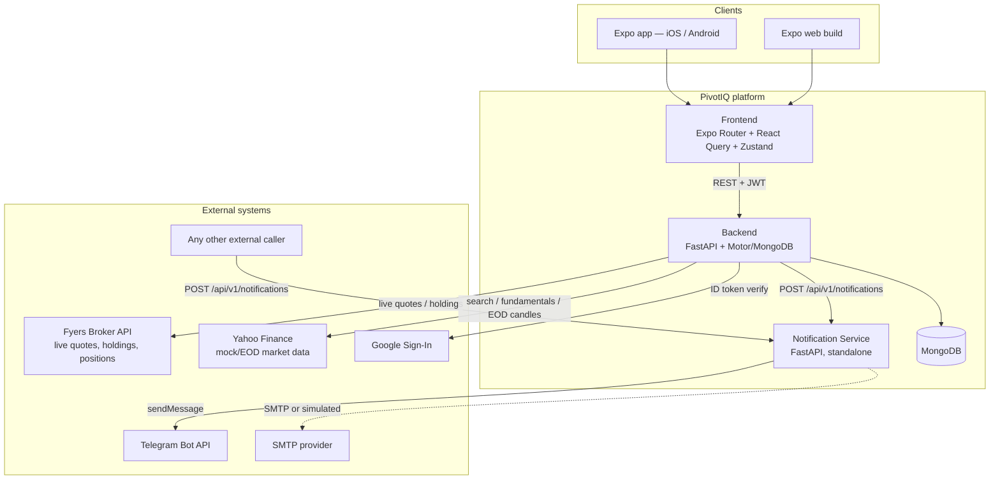
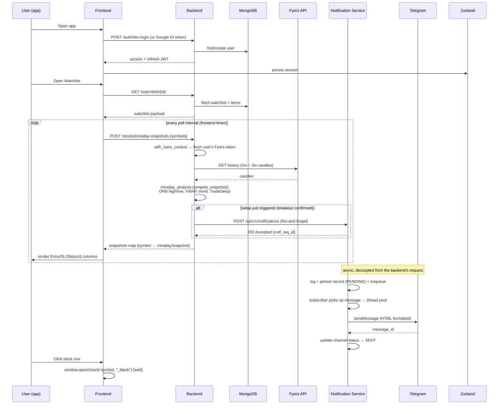
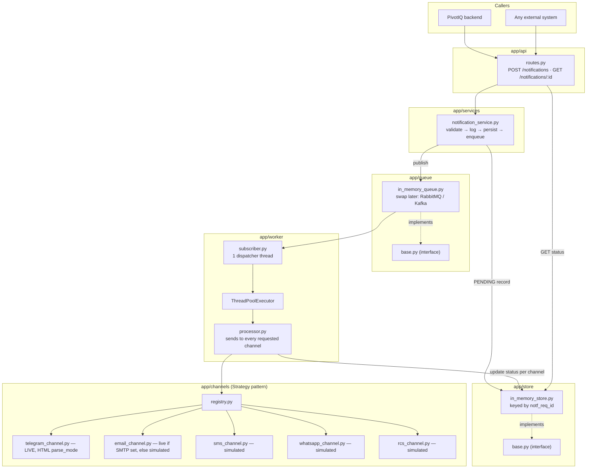
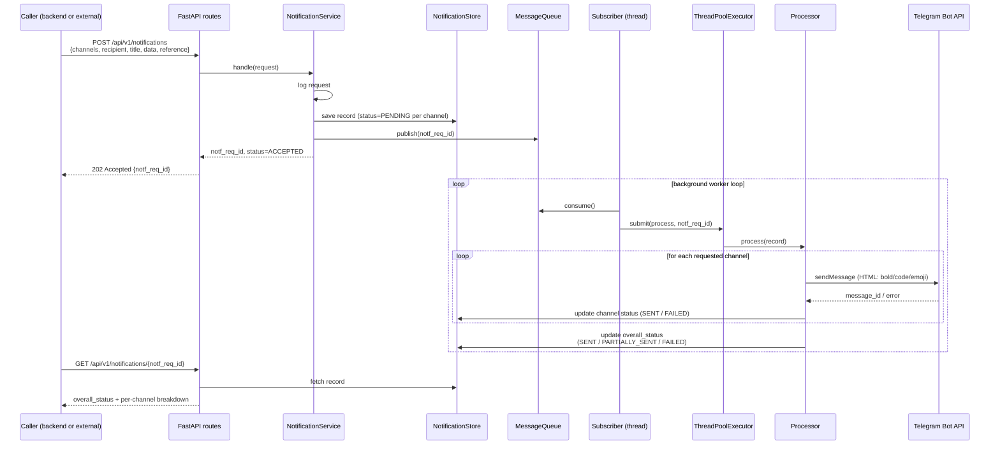
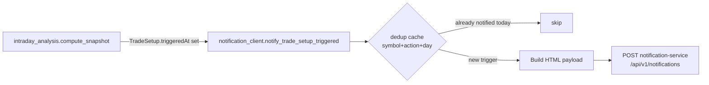

# PivotIQ — Architecture & Flow Documentation

This document describes the full system architecture of PivotIQ: system context,
components, request/data flow, and key sequence diagrams — including the
standalone notification service and its Telegram integration.

---

## 1. System context



**Key point:** the notification service has **no import dependency** on
`backend/` — it's called purely over HTTP, so any current or future system
(not just PivotIQ's own backend) can send notifications through it.

---

## 2. Repository / deployment layout

```
PivotIQ/
├── backend/                FastAPI API (Python 3.12, Motor/MongoDB)
├── frontend/                Expo React Native app (iOS / Android / Web)
├── notification-service/    Standalone FastAPI notification hub
├── docker-compose.yml       mongo + backend + frontend-web + notification-service
└── .env / .env.example
```

Each of the three services has its **own** `Dockerfile`, `requirements.txt`
(or `package.json`), and `.venv` — they can be built, deployed, and scaled
independently.

---

## 3. Backend component diagram

```mermaid
flowchart TB
    subgraph API["app/routers"]
        AUTH[auth.py — login, dev-login, refresh]
        STOCKS[stocks.py — search, quote, details,<br/>support-levels, intraday-snapshot(s)]
        WL[watchlists.py — CRUD, items]
        ALERTS[alerts.py — create/list alerts]
        TRADE[trading.py — place trade, positions, summary]
        SET[settings.py]
        FYERS_R[fyers.py — connect / status / disconnect]
    end

    subgraph SVC["app/services"]
        MD[market_data.py<br/>Yahoo-backed mock provider]
        SL[support_levels.py<br/>Classic/Fib/Camarilla/Woodie pivots]
        MC[market_context.py<br/>ContextVar-based Fyers token]
        FC[fyers_client.py<br/>Fyers REST wrapper]
        IA[intraday_analysis.py<br/>ORB + VWAP + trade setup]
        TS[trading_service.py<br/>paper-trading engine]
        NC[notification_client.py<br/>fire-and-forget alerts]
    end

    subgraph DATA["app/database + Mongo"]
        DB[(MongoDB<br/>users, watchlists, alerts,<br/>paper_trades, fyers_tokens)]
    end

    subgraph DEP["app/dependencies + security"]
        DEPS[get_current_user<br/>with_fyers_context]
        SEC[security.py — JWT encode/decode]
    end

    AUTH --> SEC
    AUTH --> DB
    STOCKS --> DEPS --> MC
    STOCKS --> MD
    STOCKS --> SL
    STOCKS --> IA --> FC
    STOCKS -->|on triggeredAt| NC -->|HTTP POST| NSExt[notification-service]
    WL --> DB
    ALERTS --> DB
    TRADE --> TS --> DB
    TRADE --> MD
    FYERS_R --> FC
    FYERS_R --> DB
```

### Backend layers
| Layer | Responsibility |
|---|---|
| `routers/` | Thin HTTP layer — request validation, auth dependency wiring, delegates to services |
| `services/` | Business logic: market data, support levels, intraday ORB analysis, paper-trading engine, outbound notification calls |
| `schemas/` | Pydantic request/response models (one per domain) |
| `database.py` | Motor (async MongoDB) client + index setup |
| `security.py` | JWT issue/verify (access + refresh tokens) |
| `dependencies.py` | `get_current_user` (JWT → user doc), `with_fyers_context` (stashes Fyers token in a `ContextVar` for sync market-data code) |

---

## 4. Frontend component diagram

```mermaid
flowchart TB
    subgraph Routes["app/ (Expo Router, file-based)"]
        Login[login.tsx]
        Tabs["(tabs)/ — search, watchlists, portfolio, alerts"]
        WLDetail[watchlist/[id].tsx]
        StockDetail[stock/[symbol].tsx]
        NewAlert[alert/new.tsx]
    end

    subgraph State["State management"]
        RQ[React Query<br/>server state, caching, polling]
        Zustand[authStore.ts<br/>Zustand — JWT/session]
    end

    subgraph API["src/api/ (typed HTTP client)"]
        Client[client.ts<br/>axios + auto token refresh]
        AuthApi[auth.ts]
        StocksApi[stocks.ts]
        WLApi[watchlists.ts]
        AlertsApi[alerts.ts]
        TradingApi[trading.ts]
        FyersApi[fyers.ts]
    end

    subgraph UI["src/components + ui/"]
        Prims[Button, Card, Input, Badge, Text, Screen]
        Domain[StockRow, CandleChart, TradePanel,<br/>SupportLevelCard, FyersLivePanel]
    end

    Routes --> RQ
    Routes --> UI
    RQ --> API
    Zustand --> Client
    API --> Client
    Client -->|Bearer JWT| Backend[(Backend API)]
```

---

## 5. End-to-end sequence — user login → watchlist → live intraday polling → alert



---

## 6. Notification Service — component diagram



---

## 7. Notification Service — sequence (accept → process → deliver → status)



---

## 8. Trade-setup-triggered alert — data model & payload



**Payload shape:**
```json
{
  "channels": ["telegram"],
  "recipient": { "telegramChatId": "-1004440440854" },
  "title": "🟢 DATAPATTNS · BUY setup triggered",
  "data": "<b>BULLISH</b> setup on <b>DATAPATTNS</b>\n━━━━━━━━━━━━━━━\n💰 Price: <b>₹4,316.00</b>\n📍 Entry: <code>₹4,300.00</code>\n🛑 Stop-Loss: <code>₹4,250.00</code> (Δ ₹66.00 · 1.55% away)\n🏁 Target: <code>₹4,400.00</code>\n⚖️ Risk:Reward: <b>2.0</b>",
  "reference": "trigger-DATAPATTNS-2026-09-16",
  "metadata": { "source": "pivotiq-backend", "symbol": "DATAPATTNS", "action": "buy" }
}
```

---

## 9. Component & responsibility summary

| Service | Tech | Key modules | Responsibility |
|---|---|---|---|
| **Frontend** | Expo (React Native) + TypeScript | `app/` (routes), `src/api/`, `src/store/`, `src/components/` | Cross-platform UI (iOS/Android/Web), typed API client with auto token refresh, React Query for server state |
| **Backend** | FastAPI + Motor/MongoDB | `routers/`, `services/`, `schemas/` | Auth, market data, watchlists, alerts, paper-trading, Fyers integration, intraday ORB analysis, fires trigger notifications |
| **Notification Service** | FastAPI (standalone) | `api/`, `services/`, `store/`, `queue/`, `worker/`, `channels/` | Accepts any external notification request, queues it, processes via thread pool, delivers over Telegram (live)/Email/SMS/WhatsApp/RCS, tracks per-channel status |

## 10. Design principles applied

- **Separation of concerns**: routers (HTTP) → services (business logic) → data/external clients.
- **Strategy pattern**: notification channels all implement `NotificationSender`; adding a channel means one new file + a registry entry.
- **Interface-first swappability**: `MessageQueue` and `NotificationStore` are abstract interfaces — the in-memory implementations can be replaced by RabbitMQ/Kafka and Postgres/Mongo without touching callers.
- **Fire-and-forget integration**: the backend never blocks a user-facing request on the notification service being up; failures are logged, not raised.
- **Idempotency/dedup**: one trigger notification per symbol per trading day, preventing alert spam from repeated polling.
- **Independent deployability**: three services, three `Dockerfile`s, one `docker-compose.yml`, no cross-service imports.
